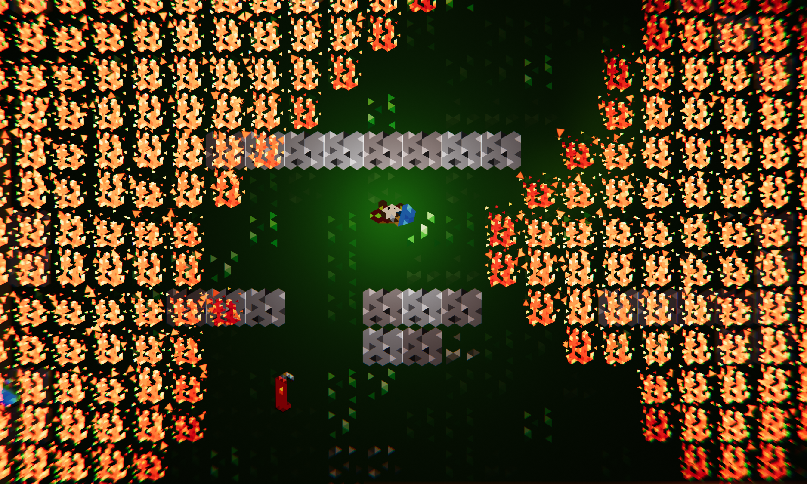

+++
title = 'Armageddon'
summary = "Ludum Dare 42 Compo Entry"

tags = ["GameJam"]
+++

I participated in **Ludum Dare** 42 in the compo category where we have 48 hours to build a small game from scratch.

The theme for Ludum Dare 42 was **Running out of space**.

In the compo category, you are required to build a game alone, create the code, audio, visuals & graphics during the jam.

With the theme at hands, I started brainstorming and arrived with a small concept idea where the **Armageddon** is at our doors, meteors would be falling from the sky constantly, starting fires on the ground.

The fire would spread rapidly and the player would have to user extinguishers and splash bombs to remove as much fire as possible. Obviously, the fire would always circle the player, and the user has to play quickly to remove more and more fire.

The game is a High Score arcade game where you need to extinguish as much fire as possible. 1 fire gives 1 point.

[Ludum Dare Submission](https://ldjam.com/events/ludum-dare/42/armageddon)

---
