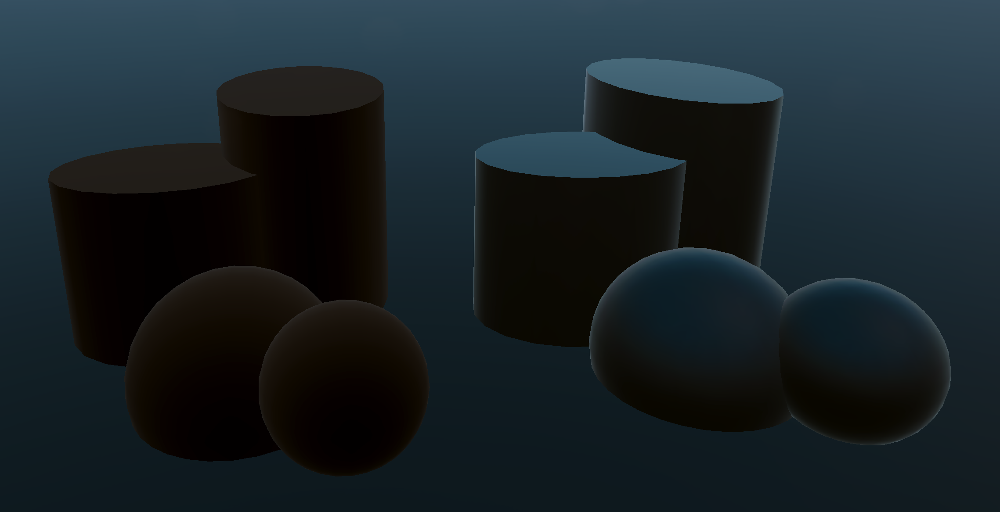

+++
title = 'Half-Lambert Shader'

tags = ["Graphics", "Tech Art"]
weight = 10
+++

Created a fully customized lighting Uber shader for our current project at [Canorous Interactive](https://www.canorousinteractive.com/), supporting nearly all the same features as Unity's main Lit shader.

The Half-Lambert lighting term is utilized in various commercial games such as Team Fortress 2 and Valorant, and extensively described online. I won't delve into the technical details and differences between the various lighting techniques, but here are some link for quick explanations and examples.

- [Riot's Valorant Shaders Article](https://technology.riotgames.com/news/valorant-shaders-and-gameplay-clarity)
- [Half-Lambert - Valve](https://developer.valvesoftware.com/wiki/Half_Lambert)

---

`Left: Custom Half-Lambert  | Right: Blinn-Phong (Unity's Lit)`

