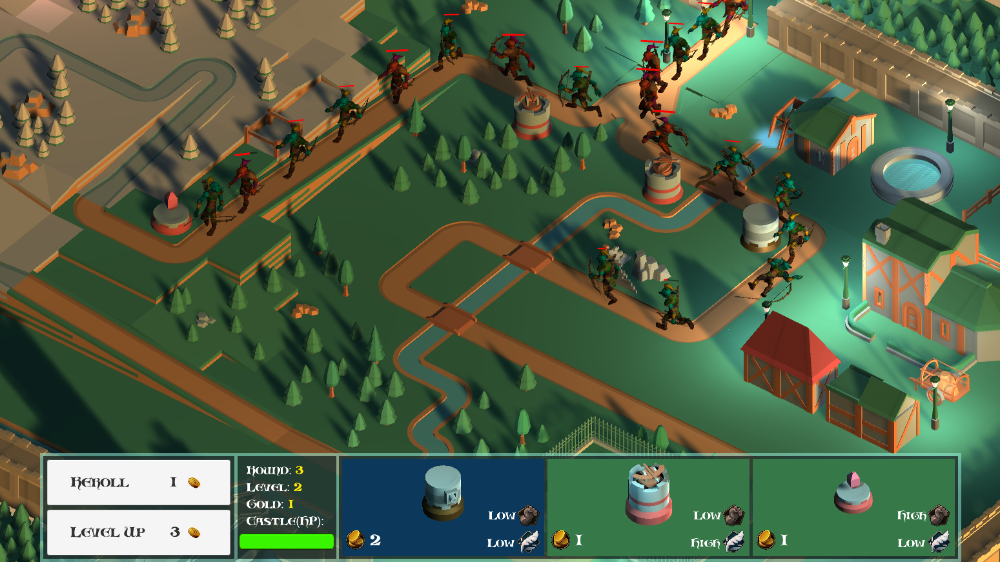
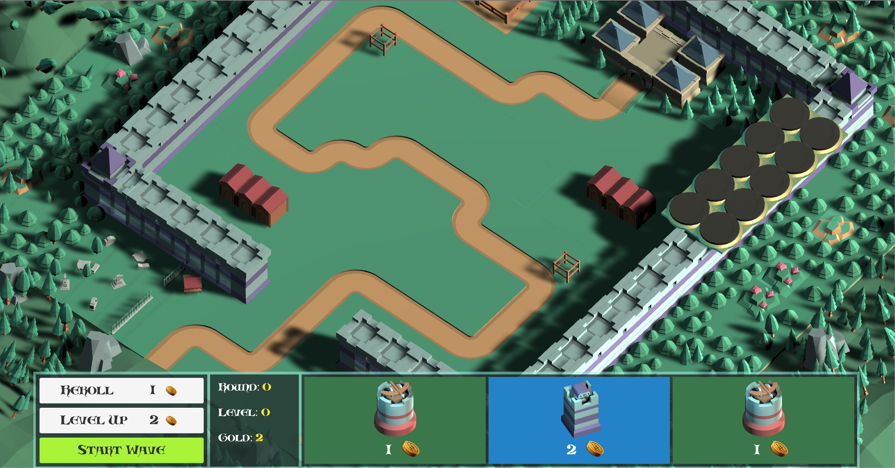
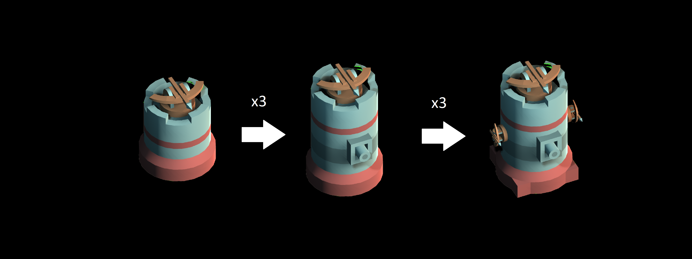

+++
title = 'Safeguard the realm'
summary = "Old game concept prototype combining tower defense with an auto-battler"

tags = ["GameJam"]
weight = 100
+++

A tower defense concept combined with an auto-battler in-game progression inspiration.

This game project was executed as a team effort with 6 people in a course of Game Development at Concordia University.

**Safeguard The Realm!** is a tower defense game where the right strategy is absolutely necessary in order to not lose. The objective of the game is to defend the castle against waves of enemies, by placing various types of defense towers on the grid map. As the waves get defeated the user will gain coins that can be used to buy more towers or upgrade the user’s level. Each round three towers are randomly made available to be bought and the higher the player’s level, the higher the chances to have three strong towers available. The player wins if they can endure the enemy waves.

The game concept is a classic tower defense gameplay mashed with a market and economy system resembling the AutoBattler games like TeamFight Tactics and Dota Underlords. Each tower has a rarity attribute, different attack behavior, and all have 3 levels with different attributes. Players can only buy level 1 towers from the market and need to have 3 towers of the same type and level in order for them to automatically combine and upgrade to a single tower of a higher level.

---



---

