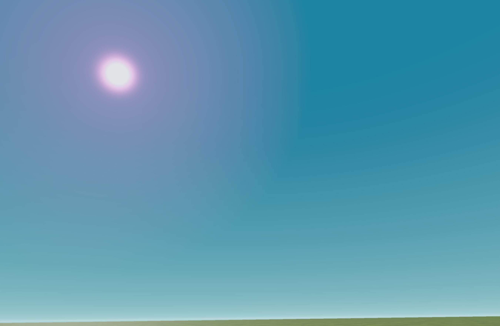

+++
title = 'Skybox Shader'
summary = "A custom procedural skybox"

tags = ["Tech Art", "Graphics"]
width = 10
+++

I developed a custom stylized procedural skybox for Unity. The sun's rendering is dynamically adjusted based on the position of the primary directional light in the scene. Additionally, it seamlessly integrates with scene fog settings, enhancing color blending at the horizon while offering control over various color parameters.

The skybox affords manipulation of the main color, horizon color, and diverse atmosphere attributes such as height, thickness, and distribution. It provides extensive customization options for the sun, including its color (though not demonstrated in the video), size, brightness bleeding parameters, among others.

With a simple script this allow for easy day/night cycles and transition between different configurations.

This shader was crafted and implemented at [Canorous Interactive](https://www.canorousinteractive.com/) for a variety of contexts.
`This is not publicly available.`

---

`These represents the render without post-process or any other color/image modifications` 


