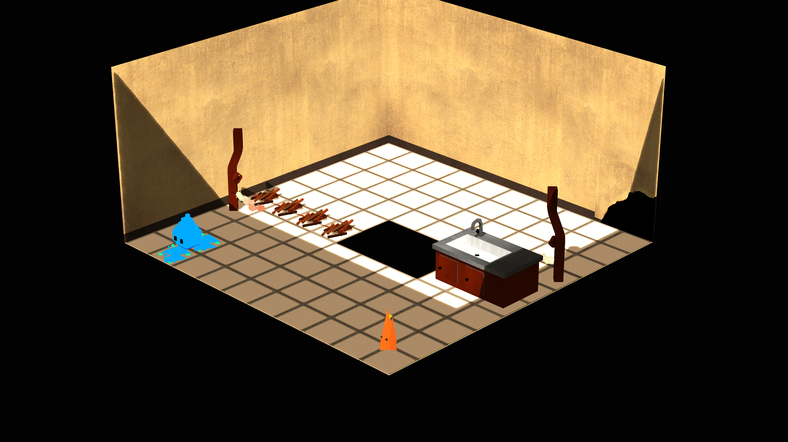
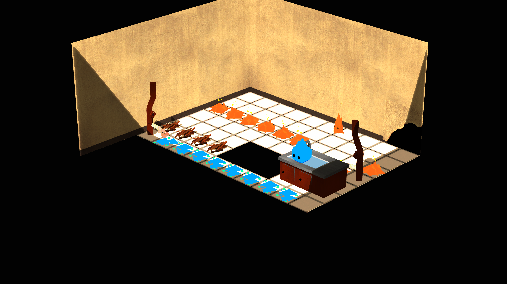
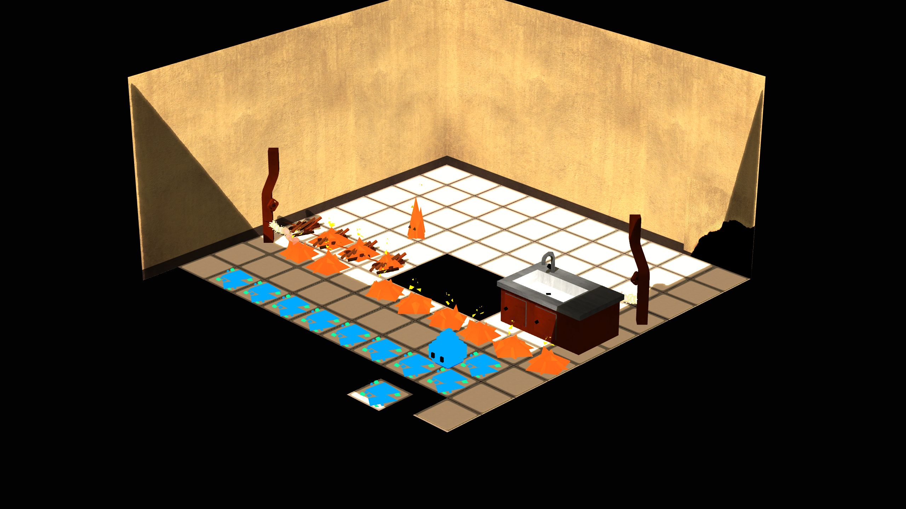
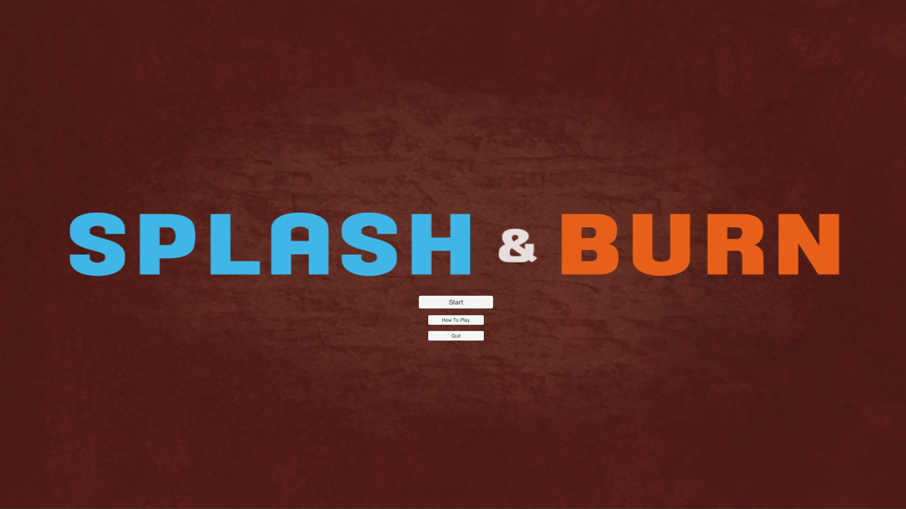

+++
title = 'SplashNBurn'
draft = true

tags = ["GameJam"]
+++

A game prototype made for the **Concordia Makes Games 2018 GameJam** in about 36 hours of development.

It’s a local coop puzzle game with only one level. (Due to time limits) It supports a controller and the keyboard, and both devices can control both characters in the game. That way, you can play alone and control both characters or play with someone.

The imposed theme was: **Unlikely Friends**

I’ve been pretty much the sole programmer for this project with the help of an artist/animator and a game designer.

The goal is to escape the room before the building collapse. The floor tiles fall apart front start to finish as the time goes. The tricky part of the gameplay is that *Splash* leaves water behind him, and *Burn* set things on fire and ignites gas lines. *Splash* cannot touch the fire, and *Burn* cannot walk on water. this leaves us with a tricky puzzle to escape the room on time and together!

---

