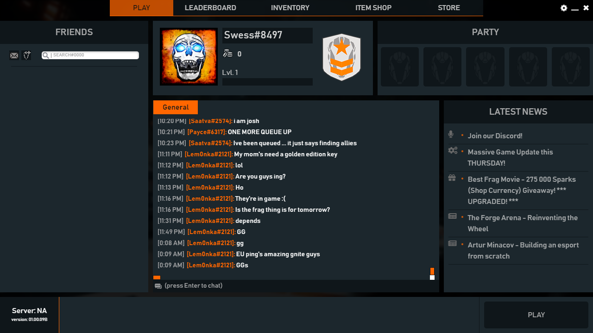
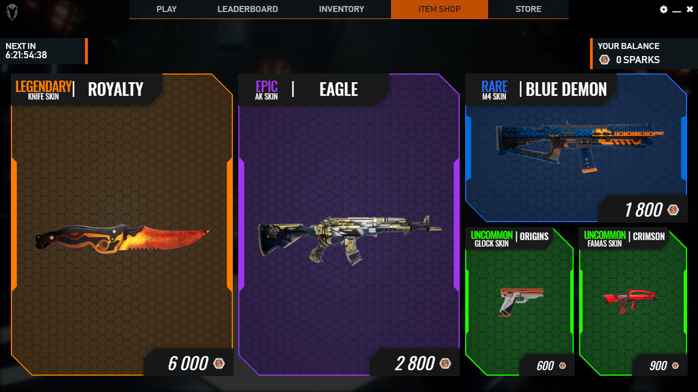

+++
title = 'The Forge Launcher'
summary = "Worked on a game launcher in the past"

tags = ["Application", "UI"]
+++

Frontend development of the Game launcher desktop application for the game The Forge Arena.

- ReactJS development of the interfaces and different sections and pages
- Entire styling of the application (Design integration)
- UX
- Continuous improvements to UI Design (Helping with design choices)

---

---

