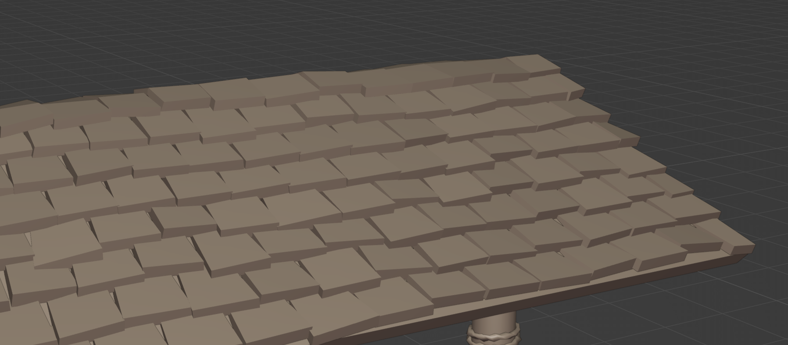
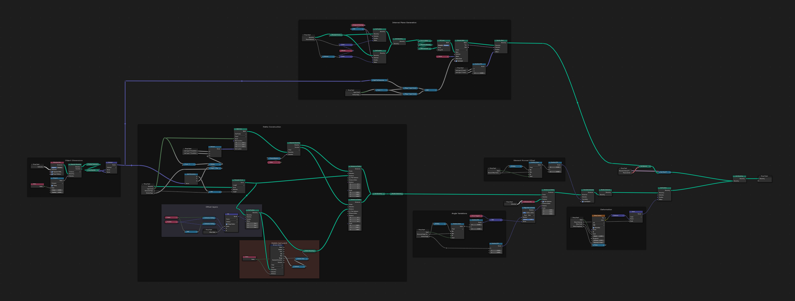

+++
title = 'Tile Pattern Tool'
summary = "Procedural placement tool"

tags = ["Tech Art", "Tools"]
weight = 20
+++

Blender tool for distributing objects from a collection of objects on a curve with height and offset parameters.
Used in our current project at [Canorous Interactive](https://www.canorousinteractive.com/).
This can be used to create roof tile patterns, walls, stairs, different type of objects arrangements, etc.

It start from an input curve and arrange objects based on their dimensions along the curve and stacked to reached a given height.
It selects a random object from the source collection for each tile and position and orients each one of them based on the given parameters.

We can also generate an internal plane geometry with different materials.

`This tool is not publicly available.`

---



