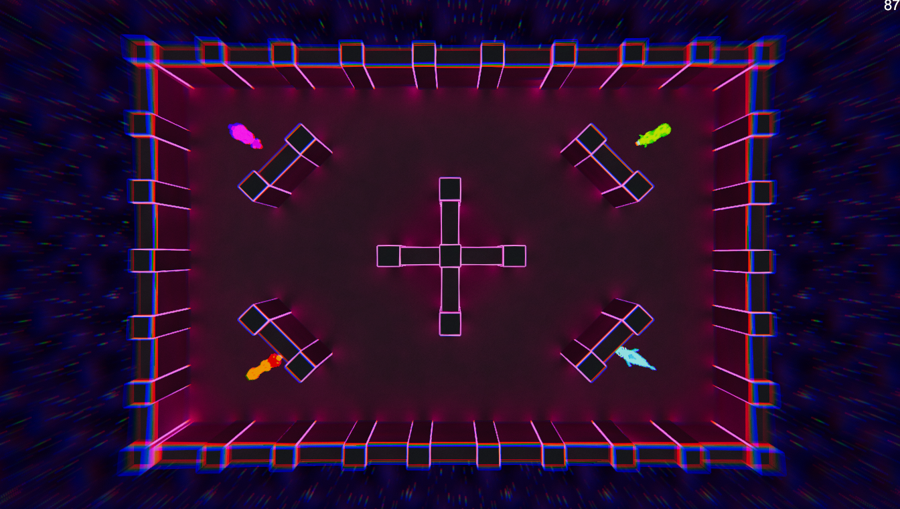

+++
title = 'U.N.I.T.Y.'
summary = "A 4 players local competitive arcade game that doesn’t take itself seriously"

tags = ["GameJam"]
+++

U.N.I.T.Y. stands for Unleash Nature Inside The Youniverse!

It is a 4 players local competitive arcade game that doesn’t take itself seriously.
The prototype has been developed with a small team of 6 persons, including 2 programmers, 1 game designer & 3 artists. Our team, called JAMKIS, was part of the second season of JamNation, in collaboration with [Unity Technologies Montréal](https://unity.com/).

The constraints of the GameJam were the following:

|||
|--|--|
| **Theme:**                 | Non-Human |
| **Technical constraint:**  | Only one input |

We decided to go with a prototype oriented towards quick arcade gameplay and to use a surreal and absurd story with it.
The game consists of 4 alien modified animals that became arena warriors and fight each other to survive.

The game has a movement phase and an attack phase that is controlled and timed by the game itself.
The players all attack at the same time, having a split second to aim during the attack phase and right after going back to the moving phase again all together.

[Play it here](https://jamkis.itch.io/unity)

---

